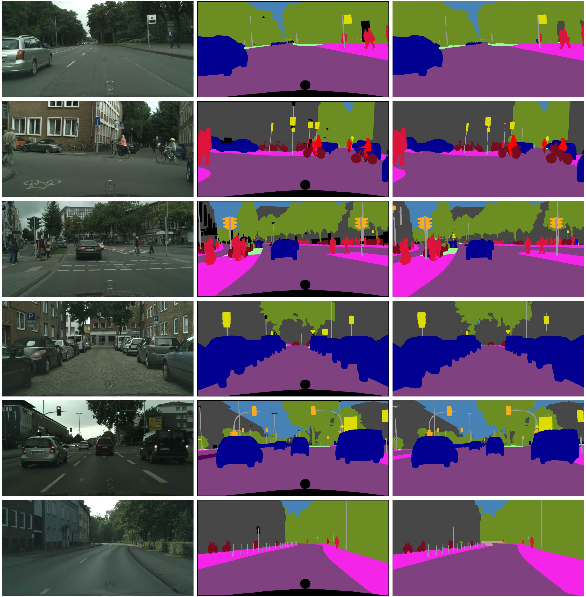

# 1.MSA-Net
Code for paper ‘Multi-unit stacked architecture: An urban scene segmentation network based on UNet and ShuffleNetv2’

## 2.Requirements
* python 3.8
* pytorch 1.11.0
* Cuda  11.3

## 3.Visualization results of MSA-Net on Cityscapes val set. From left to right are input images, ground truth, segmentation outputs.

## 4.
{| class="wikitable" style="text-align:center;"
|-
! rowspan="2" | Index
! rowspan="2" | Baseline
! rowspan="2" | DLED
! rowspan="2" | ESCC
! rowspan="2" | MSIC
! colspan="2" | mIoU
! rowspan="2" | Params
|-
| Cityscapes
| VOC 2012 Augment
|-
| 1
| ✓
| 
| 
| 
| 63.3
| 45.5
| 31.0M
|-
| 2
| ✓
| ✓
| 
| 
| 65.5
| 58.2
| 7.0M
|-
| 3
| ✓
| ✓
| ✓
| 
| 72.6
| 64.2
| 7.1M
|-
| 4
| ✓
| ✓
| ✓
| ✓
| 73.6
| 65.3
| 7.6M
|}

## 5.Comparisons with State-of-the-art Results
### 'ImN' and 'Coa.' mean pre-training model using ImageNet dataset or the coarse annotation set of Cityscapes dataset. '–' indicates that the corresponding result is not provided by the method.
|    Model   | Extra data | Resolution | mIoU | Params |
|:----------:|:----------:|:----------:|:----:|:------:|
|   SegNet   |     ImN    |   640×360  | 57.0 |  29.5M |
|   DeepLab  |     ImN    |  1024×512  | 63.1 | 262.1M |
|  RefineNet |     ImN    |  1024×512  | 73.6 | 118.1M |
|   PSPNet   |  ImN+Coa.  |   713×713  | 80.2 | 250.8M |
|    E-Net   |     no     |  1024×512  | 58.3 |  0.36M |
|  Fast-SCNN |    Coa.    |  1024×512  | 62.8 |  1.14M |
|    CGNet   |     no     |  1024×512  | 64.8 |  0.5M  |
|   ERF-Net  |     no     |  1024×512  | 68.0 |  20.0M |
|  DFA-Net B |     no     |  1024×1024 | 67.1 |  4.8M  |
|   AGLNet   |     no     |  1024×512  | 70.1 |  1.12M |
|  DFANet A  |     no     |  1024×1024 | 71.3 |  7.8M  |
| Bise-Netv1 |     ImN    |  1024×512  | 71.4 |  5.8M  |
|   MFENet   |     no     |  1024×512  | 72.4 |  8.0M  |
| Bise-Netv2 |     ImN    |  2048×1024 | 72.6 |    -   |
| Ghost-UNet |     no     |   512×512  | 73.2 |  5.8M  |
|    Ours    |     no     |   512×512  | 73.6 |  7.6M  |

## *Results on Cityscapes test set(Anonymous Link)
* [UNet(Baseline)](https://www.cityscapes-dataset.com/anonymous-results/?id=98b31a77d61d1ec3c42412c7cb7291c75fbb1b382dbdb40983c92aa0420e0526)
* [Baseline + DLED(Stack-Net-More)](https://www.cityscapes-dataset.com/anonymous-results/?id=2578bf048dfc01c61d0fb3da8f95473f3329dff55ae071549d26eb56ecff9ea4)
* [Baseline + DLED_SE(Stack-Net-One)](https://www.cityscapes-dataset.com/anonymous-results/?id=620bd8e0bd92281f046c1748f60a7b3b9db5d7b5aae96bb89dde7001ad37c4b2)
* [Baseline + DLED + ESCC](https://www.cityscapes-dataset.com/anonymous-results/?id=417cea22d2b0a4c138c908cae163ddc496ef42420edf763a408aee50ea15a64d)
* [Baseline + DLED + ESCC + MSIC](https://www.cityscapes-dataset.com/anonymous-results/?id=a962c6795c460027641a810a627ec30a8c52a4868eff7bf8f5f50a1b940f6a1b)
* [Baseline + ESCC](https://www.cityscapes-dataset.com/anonymous-results/?id=2bca6283315dfe057235e9fca9707a329719a879e7fc0ac0089791ab8adbb394)>
## *A demo video of segmentation: 
* [YouTube](https://youtube.com/shorts/_H0DLRKsO7Q?feature=share)
