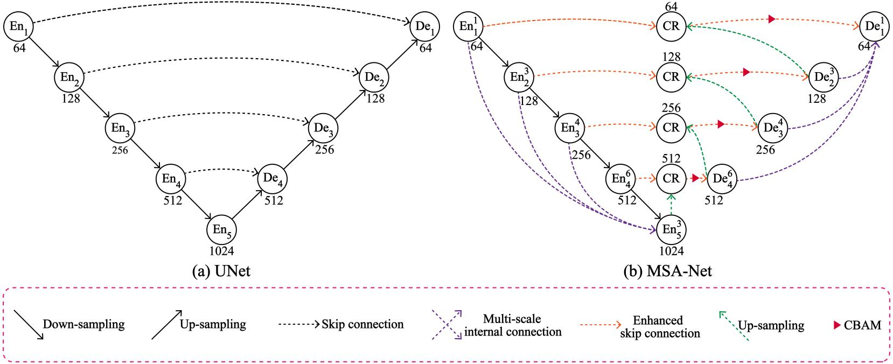

## 1.MSA-Net
Code for paper ‘Multi-unit stacked architecture: An urban scene segmentation network based on UNet and ShuffleNetv2’

## 2.Requirements
* python 3.8
* pytorch 1.11.0
* Cuda  11.3

## 3.Visualization results of MSA-Net on Cityscapes val set.
*From left to right are input images, ground truth, segmentation outputs.

## 4.Ablation study results of MSA-Net on Cityscapes test dataset and enhanced PASCAL VOC 2012 val dataset.
| Index | Baseline | DLED | ESCC | MSIC | Cityscapes | VOC 2012 Augment | Params |
|:-----:|:--------:|:----:|:----:|:----:|:----------:|:----------------:|:------:|
|   1   |     ✓    |      |      |      |    63.3    |       45.5       |  31.0M |
|   2   |     ✓    |   ✓  |      |      |    65.5    |       58.2       |  7.0M  |
|   3   |     ✓    |   ✓  |   ✓  |      |    72.6    |       64.2       |  7.1M  |
|   4   |     ✓    |   ✓  |   ✓  |   ✓  |    73.6    |       65.3       |  7.6M  |

### *The comprehensive experiments show our MSA-Net achieves best trade-off on the Cityscapes dataset in terms of segmentation accuracy and parameters, and exhibits strong generalization on the enhanced PASCAL VOC 2012 dataset.
## 5.Comparisons between different channel depths on Cityscapes val dataset. 
*Performed on a single RTX 4090 GPU
 *Note that the format {., ., ., .,} represents the channel depth in encoder of MSA-Net, and the channel depth in the decoder and encoder are symmetric. r represents the channel compression ratio.
|      Model      |            Channel depth           | mIoU | Params | GFLOPs |  FPS |
|:---------------:|:----------------------------------:|:----:|:------:|:------:|:----:|
|     MSA-Net    | {64, 128, 256, 512, 1024 \| r = 1} | 74.7 |  7.6M  |  43.7  | 31.0 |
| MSA-Net-Middle | {32, 64, 128, 256, 512 \| r = 0.5} | 72.0 |  1.9M  |  11.4  | 33.7 |
|  MSA-Net-Slim  | {16, 32, 64, 128, 256 \| r = 0.25} | 63.8 |  0.5M  |   3.1  | 36.3 |
## *Results on Cityscapes test set(Anonymous Link)
* [UNet(Baseline)](https://www.cityscapes-dataset.com/anonymous-results/?id=98b31a77d61d1ec3c42412c7cb7291c75fbb1b382dbdb40983c92aa0420e0526)
* [Baseline + DLED(Stack-Net-More)](https://www.cityscapes-dataset.com/anonymous-results/?id=2578bf048dfc01c61d0fb3da8f95473f3329dff55ae071549d26eb56ecff9ea4)
* [Baseline + DLED_SE(Stack-Net-One)](https://www.cityscapes-dataset.com/anonymous-results/?id=620bd8e0bd92281f046c1748f60a7b3b9db5d7b5aae96bb89dde7001ad37c4b2)
* [Baseline + DLED + ESCC](https://www.cityscapes-dataset.com/anonymous-results/?id=417cea22d2b0a4c138c908cae163ddc496ef42420edf763a408aee50ea15a64d)
* [Baseline + DLED + ESCC + MSIC](https://www.cityscapes-dataset.com/anonymous-results/?id=a962c6795c460027641a810a627ec30a8c52a4868eff7bf8f5f50a1b940f6a1b)
* [Baseline + ESCC](https://www.cityscapes-dataset.com/anonymous-results/?id=2bca6283315dfe057235e9fca9707a329719a879e7fc0ac0089791ab8adbb394)
## *A demo video of segmentation:
* [YouTube](https://youtube.com/shorts/_H0DLRKsO7Q?feature=share)
